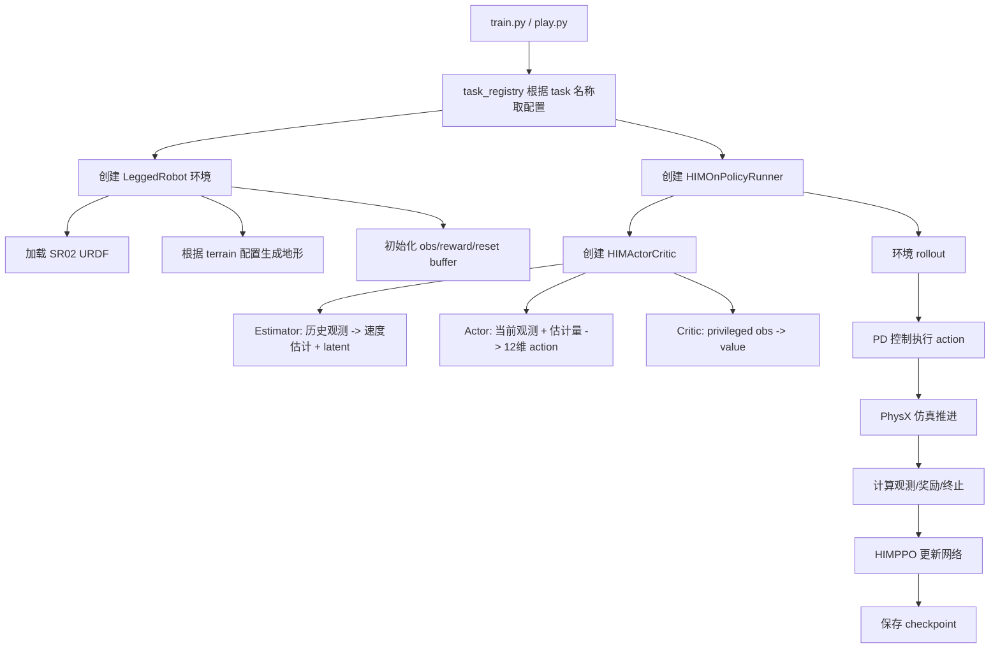
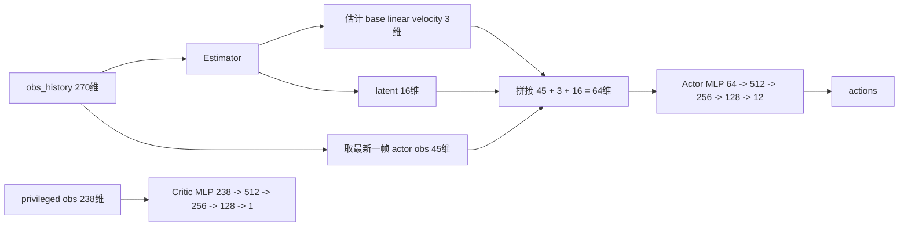
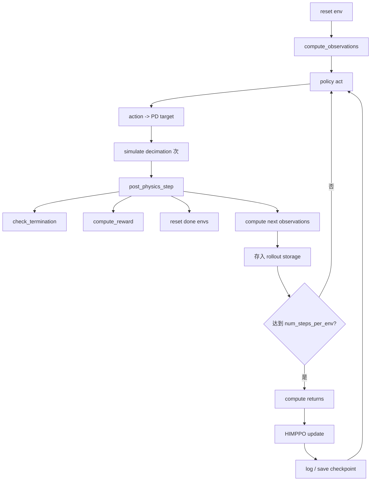
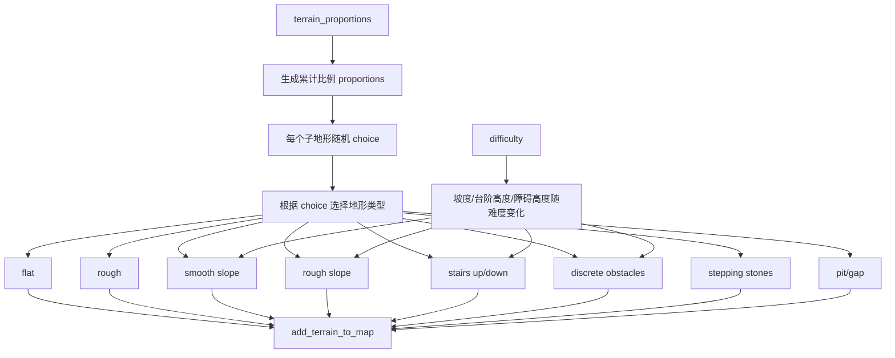

# SR02 行走算法说明

本文档记录当前工程里 SR02 的两套主要训练任务：

- `sr02`：基础行走 + 复杂地形鲁棒行走。配置文件是 `legged_gym/legged_gym/envs/sr02/sr02_config.py`。
- `sr02_stairs`：在基础行走上继续训练的盲走台阶/随机坎路面任务。配置文件是 `legged_gym/legged_gym/envs/sr02/sr02_stairs_config.py`。

两套任务都使用同一个环境类 `LeggedRobot`，同一个 SR02 URDF，同一个 HIM-PPO 算法框架。区别主要在地形比例、命令范围、随机化强度、奖励权重和训练目标。

## 任务入口

任务在 `legged_gym/legged_gym/envs/__init__.py` 注册：

```python
task_registry.register("sr02", LeggedRobot, Sr02RoughCfg(), Sr02RoughCfgPPO())
task_registry.register("sr02_stairs", LeggedRobot, Sr02StairsCfg(), Sr02StairsCfgPPO())
```

常用命令：

```bash
# 基础行走/复杂地形
python3 legged_gym/legged_gym/scripts/train.py --task=sr02

# 台阶任务，从基础行走模型继续训练
python3 legged_gym/legged_gym/scripts/train.py \
  --task=sr02_stairs \
  --resume \
  --load_run Apr30_16-46-56_ \
  --checkpoint 1300

# 回放
python3 legged_gym/legged_gym/scripts/play.py --task=sr02
python3 legged_gym/legged_gym/scripts/play.py --task=sr02_stairs
```

## 总体流程



## 机器人与控制

当前 SR02 使用 12 个关节：

```text
FL_hip_Joint, FR_hip_Joint, HL_hip_Joint, HR_hip_Joint
FL_thigh_Joint, FR_thigh_Joint, HL_thigh_Joint, HR_thigh_Joint
FL_calf_Joint, FR_calf_Joint, HL_calf_Joint, HR_calf_Joint
```

默认站姿：

```python
hip:   FL=-0.05, FR=0.05, HL=-0.05, HR=0.05
thigh: FL=-0.795, FR=0.795, HL=-0.795, HR=0.795
calf:  all=1.6
```

控制方式是位置控制：

```python
target_dof_pos = default_dof_pos + action * action_scale
torque = kp * (target_dof_pos - dof_pos) - kd * dof_vel
```

当前主要控制参数：

```python
control_type = "P"
stiffness = {"Joint": 200.0}
damping = {"Joint": 5.0}
action_scale = 0.3
sim.dt = 0.005
decimation = 2
policy_dt = 0.01
```

所以策略网络每 0.01 秒输出一次 12 维动作。

## 观测设计

### Actor 输入

`sr02` 和 `sr02_stairs` 都是盲走策略。Actor 不直接输入 heightmap，也不直接输入深度相机/雷达。

单步 actor 观测是 45 维：

```text
commands:          3  -> vx, vy, yaw_rate
base_ang_vel:      3
projected_gravity: 3
joint_pos:         12 -> dof_pos - default_dof_pos
joint_vel:         12
last_actions:      12
total:             45
```

使用 6 帧历史：

```text
num_observations = 45 * 6 = 270
```

观测更新逻辑在 `LeggedRobot.compute_observations()`：

```python
self.obs_buf = torch.cat(
    (current_obs[:, :self.num_one_step_obs], self.obs_buf[:, :-self.num_one_step_obs]),
    dim=-1
)
```

这表示最新一帧放在最前面，后面拼 5 帧历史。

### Critic / Privileged 输入

Critic 使用 privileged observation，单步 238 维：

```text
actor_obs:             45
base_lin_vel:           3
disturbance force:      3
height measurements:  187
total:                238
```

高度扫描 187 维来自：

```python
measured_points_x = 17 个点
measured_points_y = 11 个点
17 * 11 = 187
```

这些高度数据只进入 critic/privileged obs，不进入 actor。所以目前 `sr02` 和 `sr02_stairs` 训练出来的策略部署时不需要雷达/深度相机高度图。

## HIMActorCritic 网络

当前策略类是 `HIMActorCritic`。



Actor 输入不是完整 270 维，而是：

```text
最新一帧 45维 + estimator预测速度3维 + estimator latent16维 = 64维
```

Estimator 使用 270 维历史观测学习隐变量，相当于让 actor 在没有真实线速度、没有地形图的情况下，仍然能通过历史动作和姿态变化推测身体状态。

## HIM 代码定位与常见概念

这一节记录 HIM 相关代码的真实数据流，避免把 45 维、270 维和 64 维混在一起。

### 关键代码位置

| 内容 | 文件 | 关键函数/位置 |
| --- | --- | --- |
| 环境构造观测 | `legged_gym/legged_gym/envs/base/legged_robot.py` | `compute_observations()` |
| 创建 HIM 网络 | `rsl_rl/rsl_rl/runners/him_on_policy_runner.py` | `actor_critic_class(...)` |
| HIM 网络结构 | `rsl_rl/rsl_rl/modules/him_actor_critic.py` | `HIMActorCritic.__init__()` |
| estimator 网络 | `rsl_rl/rsl_rl/modules/him_estimator.py` | `HIMEstimator` |
| PPO 调用策略 | `rsl_rl/rsl_rl/algorithms/him_ppo.py` | `self.actor_critic.act(obs)` |
| estimator 更新 | `rsl_rl/rsl_rl/algorithms/him_ppo.py` | `self.actor_critic.estimator.update(...)` |

### 45 维单步观测是什么

`LeggedRobot.compute_observations()` 先拼出单步普通观测。对 `sr02` / `sr02_stairs` 来说是 45 维：

```text
commands:             3  -> vx, vy, yaw_rate
base_ang_vel:         3  -> 机身角速度
projected_gravity:    3  -> 重力在机身坐标系下的方向，代表姿态
dof_pos deviation:   12  -> dof_pos - default_dof_pos
dof_vel:             12  -> 关节速度
last_actions:        12  -> 上一步网络输出
total:               45
```

对应代码：

```python
current_obs = torch.cat((
    self.commands[:, :3] * self.commands_scale,
    self.base_ang_vel * self.obs_scales.ang_vel,
    self.projected_gravity,
    (self.dof_pos - self.default_dof_pos) * self.obs_scales.dof_pos,
    self.dof_vel * self.obs_scales.dof_vel,
    self.actions,
), dim=-1)
```

这 45 维里没有 estimator 的输出。它只是环境提供的原始本体观测。

### 270 维历史观测是什么

HIM 不是只看一帧 45 维，而是保存 6 帧历史：

```text
obs_buf = [t当前45维, t-1的45维, t-2的45维, t-3的45维, t-4的45维, t-5的45维]
num_observations = 45 * 6 = 270
```

历史缓存更新代码：

```python
self.obs_buf = torch.cat(
    (current_obs[:, :self.num_one_step_obs],
     self.obs_buf[:, :-self.num_one_step_obs]),
    dim=-1,
)
```

最新一帧永远在最前面，所以：

```python
obs_history[:, :45]
```

就是当前最新的 45 维观测。

270 维看起来是 45 维重复 6 次，但它不是无意义重复，而是时间序列。estimator 可以从这些时间变化中推断隐藏状态，例如 base 线速度、滑移趋势、外力扰动后的运动趋势、接触变化等。

### actor 的 64 维输入从哪里来

在 `HIMActorCritic.__init__()` 里，actor MLP 第一层输入维度这样定义：

```python
mlp_input_dim_a = num_one_step_obs + 3 + 16
actor_layers.append(nn.Linear(mlp_input_dim_a, actor_hidden_dims[0]))
```

对 `sr02_stairs`：

```text
num_one_step_obs = 45
mlp_input_dim_a = 45 + 3 + 16 = 64
```

所以 actor MLP 不是直接吃 270 维，也不是只吃 45 维。它真正吃的是：

```text
当前最新45维观测
+ estimator 估计的 base linear velocity 3维
+ estimator 输出的 latent 16维
= 64维
```

对应代码在 `HIMActorCritic.update_distribution()`：

```python
with torch.no_grad():
    vel, latent = self.estimator(obs_history)

actor_input = torch.cat(
    (obs_history[:, :self.num_one_step_obs], vel, latent),
    dim=-1,
)
mean = self.actor(actor_input)
```

这里不是把 estimator 的结果“塞进 45 维内部”，而是把不同含义的特征并排拼接：

```text
actor_input[0:45]   = 当前普通观测
actor_input[45:48]  = estimator 估计的 base 线速度
actor_input[48:64]  = estimator latent
```

训练和部署都遵循同一个流程：

```text
270维历史观测 -> estimator -> vel + latent -> 拼成64维 actor_input -> actor -> 12维 action
```

### estimator 是什么

`estimator` 是 HIM 里的状态估计小网络。它输入完整 270 维历史观测，输出：

```text
vel:     3维，估计 base 线速度
latent: 16维，隐变量
```

核心定义在 `rsl_rl/rsl_rl/modules/him_estimator.py`：

```python
self.encoder = nn.Sequential(...)
```

`encoder` 最后一层输出维度是：

```text
3 + 16 = 19
```

训练 estimator 的地方在 `HIMPPO.update()`：

```python
estimation_loss, swap_loss = self.actor_critic.estimator.update(
    obs_batch,
    next_critic_obs_batch,
    lr=self.learning_rate,
)
```

其中 `estimation_loss` 用 privileged obs 里的真实 `base_lin_vel` 监督 estimator 的速度估计：

```python
vel = next_critic_obs[:, self.num_one_step_obs:self.num_one_step_obs+3].detach()
estimation_loss = F.mse_loss(pred_vel, vel)
```

注意 actor 使用 estimator 输出时用了：

```python
with torch.no_grad():
    vel, latent = self.estimator(obs_history)
```

意思是 actor 会使用 estimator 的输出，但 PPO 的 actor loss 不直接反传更新 estimator。estimator 有自己的 `update()`。

### actor 是什么

`actor` 是真正输出控制动作的策略网络。它输入 64 维 `actor_input`，输出 12 维动作：

```text
64 -> 512 -> 256 -> 128 -> 12
```

12 维动作对应 12 个关节的目标偏移。部署时通常使用 actor 输出的均值作为动作：

```text
target_joint_pos = default_joint_pos + action * action_scale
```

### critic 是什么

`critic` 是训练时的价值函数网络，负责评估当前状态未来大概能拿多少奖励：

```text
privileged obs 238维 -> critic -> value 1维
```

critic 不直接输出动作。它帮助 PPO 判断 actor 的动作比预期好还是差，从而更新策略。

部署时不需要 critic。导出的策略通常只保留：

```text
obs_history -> estimator -> actor -> action
```

### 对称和非对称 Actor-Critic

对称训练指 actor 和 critic 看同样的信息：

```text
actor  输入: 普通观测
critic 输入: 普通观测
```

非对称训练指 actor 和 critic 看不同的信息。当前 SR02 HIM 属于非对称训练：

```text
actor  看: 部署时真实可用的信息，即 270维历史本体观测
critic 看: 仿真训练时额外可用的信息，即 privileged obs
```

`sr02_stairs` 的 privileged obs 是：

```text
actor_obs:             45
base_lin_vel:           3
disturbance force:      3
height measurements:  187
total:                238
```

这种设计的目的：

```text
actor 少看一点，保证能部署；
critic 多看一点，训练时打分更准、更稳定。
```

部署时没有 privileged obs，也不需要地形高度扫描给 actor。critic 训练完就不参与实机推理。

### HIM 是不是教师学生网络

这套 HIM 有一点 teacher-student 的味道，但不是典型的“teacher policy -> student policy”蒸馏。

更准确地说，它是：

```text
历史 estimator + privileged critic 的非对称 actor-critic 训练
```

其中：

```text
estimator 像学生：只看历史普通观测，学习估计隐藏状态
privileged obs 像老师信息：训练时提供真实 base 线速度、扰动力、地形扫描等监督或价值评估信息
```

但代码里没有一个单独的 teacher policy 输出动作来教 student policy。动作策略本身就是 actor。

## 训练循环



关键训练参数：

```python
num_envs = 4096
num_steps_per_env = 100
learning_rate = 1e-3
num_learning_epochs = 5
num_mini_batches = 4
gamma = 0.99
lam = 0.95
desired_kl = 0.01
entropy_coef = 0.01
```

`sr02` 当前：

```python
experiment_name = "flat_sr02"
max_iterations = 15000
save_interval = 100
resume = True
```

`sr02_stairs` 当前：

```python
experiment_name = "stairs_sr02"
max_iterations = 8000
save_interval = 100
resume = False  # 命令行可用 --resume 覆盖
```

## 地形生成逻辑

地形生成在 `legged_gym/legged_gym/utils/terrain.py`。



### sr02 地形

`sr02` 现在不是纯平地，它是基础行走 + 复杂地形混训：

```python
terrain_proportions = [
    0.10,  # flat
    0.10,  # rough
    0.15,  # smooth_slope
    0.15,  # rough_slope
    0.20,  # stairs_up
    0.20,  # stairs_down
    0.10,  # discrete_obstacles
    0.00,  # stepping_stones
    0.00,  # pit
    0.00,  # gap
]
```

当前复杂地形参数比较硬：

```python
slope_min_deg = 20.0
slope_max_deg = 25.0
stairs_step_height_min = 0.20
stairs_step_height_max = 0.24
stairs_step_width = 0.35
```

这套适合训练“复杂地形鲁棒行走”，但如果从零开始训练，难度会比纯平地大很多。比较稳的路线是先有一个平地/低难度模型，再逐步进入这套配置。

### sr02_stairs 地形

`sr02_stairs` 是上台阶专用：

```python
terrain_proportions = [
    0.05,  # flat
    0.10,  # rough
    0.10,  # smooth_slope
    0.10,  # rough_slope
    0.30,  # stairs_up
    0.25,  # stairs_down
    0.10,  # discrete_obstacles
    0.00,  # stepping_stones
    0.00,  # pit
    0.00,  # gap
]
```

台阶高度范围：

```python
stairs_step_height_min = 0.10
stairs_step_height_max = 0.30
stairs_step_width = 0.35
max_init_terrain_level = 2
```

`discrete_obstacles` 在这里保留，用作随机块/坎路面：

```python
discrete_obstacles_height_min = 0.03
discrete_obstacles_height_max = 0.12
discrete_obstacles_num_rectangles = 35
discrete_obstacles_min_size = 0.35
discrete_obstacles_max_size = 0.90
```

这样不是为了让机器人翻墙，而是让策略学会遇到随机起伏、坎、块状地面时抬脚和防绊。

## 奖励结构

奖励函数在 `LeggedRobot` 中实现，配置里只控制权重。

```mermaid
flowchart TD
    A[总奖励] --> B[速度跟踪]
    A --> C[身体稳定]
    A --> D[关节/能耗正则]
    A --> E[动作平滑]
    A --> F[接触与防撞]
    A --> G[足端步态]

    B --> B1[tracking_lin_vel]
    B --> B2[tracking_ang_vel]

    C --> C1[lin_vel_z]
    C --> C2[ang_vel_xy]
    C --> C3[orientation]
    C --> C4[stand_roll]
    C --> C5[base_height]

    D --> D1[torques]
    D --> D2[dof_acc]
    D --> D3[joint_power]
    D --> D4[hip_pos / feet_mirror]

    E --> E1[action_rate]
    E --> E2[smoothness]

    F --> F1[collision]
    F --> F2[feet_contact_forces]
    F --> F3[feet_stumble]
    F --> F4[obstacle_contact_clearance]
    F --> F5[feet_slide]

    G --> G1[feet_air_time]
    G --> G2[contact_count]
    G --> G3[feet_clearance_terrain]
    G --> G4[feet_yaw_clearance_terrain]
    G --> G5[stuck]
```



### sr02 奖励特点

`sr02` 偏综合：速度跟踪、姿态稳定、低能耗、防跳、防滑、适当抬脚。

关键值：

```python
tracking_lin_vel = 2.0
tracking_ang_vel = 1.8
lin_vel_z = -4.0
orientation = -4.0
stand_roll = -4.0
base_height = -2.5
torques = -0.0001
dof_acc = -1.5e-7
action_rate = -0.008
smoothness = -0.003
collision = -2.0
feet_air_time = 0.8
feet_clearance_terrain = -0.12
feet_height_target_terrain = 0.10
```

这套会让机器人走得稳、脚不过分乱飞。`feet_height_target_terrain=0.10` 不算高，所以它更像复杂地形基础行走，不是专门跨 30cm 台阶。

### sr02_stairs 奖励特点

`sr02_stairs` 更强调台阶抬脚、防绊、减少卡住：

```python
tracking_lin_vel = 2.0
tracking_ang_vel = 1.6
lin_vel_z = -4.0
orientation = -3.0
stand_roll = -3.0
base_height = -2.5
action_rate = -0.010
smoothness = -0.004
collision = -3.0
feet_air_time = 0.60
contact_count = -0.06
feet_stumble = -1.5
obstacle_contact_clearance = -2.0
feet_slide = -0.02
feet_clearance_terrain = -0.22
feet_height_target_terrain = 0.24
stuck = -0.10
```

核心是这两项：

```python
feet_clearance_terrain = -0.22
feet_height_target_terrain = 0.24
```

`_reward_feet_clearance_terrain` 的逻辑是：足端有水平运动时，如果离地高度偏离目标高度，就给惩罚。因为权重是负数，所以策略会学到“移动脚时把脚抬到目标高度附近”。这对盲走台阶很重要。

`_reward_obstacle_contact_clearance` 的逻辑是：当足端受到较大的水平接触力，说明脚可能撞到了台阶/障碍物侧面；如果此时足端高度低于目标高度，就额外给惩罚。它的作用是补上“碰到台阶边缘后要抬腿”的反馈。

## 两套任务的关系


推荐训练路径：

1. 先训练 `sr02`，得到稳定站立、前进、转向都不错的模型。
2. 用这个模型 resume 到 `sr02_stairs`。
3. `sr02_stairs` 前 500-1000 轮观察是否能站住、是否明显抬脚。
4. 能站住但蹭台阶：提高 `feet_height_target_terrain` 或 `feet_clearance_terrain`。
5. 抬脚太高、变跳：降低 `feet_air_time` 或降低 `feet_height_target_terrain`。
6. 台阶上容易趴：加强 `collision`、`feet_stumble`，或降低初始 `max_init_terrain_level`。

## 参数调试指南

| 现象 | 优先检查/修改 |
| --- | --- |
| 站不住、早期大量摔倒 | 降低 `max_init_terrain_level`，减小 domain randomization，降低 `termination` 绝对值 |
| 不敢迈腿、小碎步 | 降低 `action_rate`/`smoothness`，提高 `feet_air_time` |
| 碰台阶不知道抬脚 | 提高 `feet_clearance_terrain` 绝对值，提高 `feet_height_target_terrain` |
| 抬腿太高、像跳 | 降低 `feet_air_time`，降低 `feet_height_target_terrain`，加强 `lin_vel_z` |
| 脚滑 | 加强 `feet_slide`，检查摩擦范围 |
| 腿/小腿撞台阶 | 加强 `collision` 和 `feet_stumble` |
| 转向拧巴 | 降低 `tracking_ang_vel` 或命令 yaw 范围，加强 `feet_yaw_clearance_terrain` |
| 后腿外叉 | 加强 `hip_pos` 或检查腿序/URDF关节方向 |
| 头高尾低 | 加强 `orientation`/`pitch` 类惩罚，检查默认站姿和质心 |
| 学会站立但速度跟不上 | 提高 `tracking_lin_vel`，降低能耗/动作惩罚 |

## 与感知行走的区别

当前 `sr02` 和 `sr02_stairs` 都是盲走：

- Actor 输入没有 heightmap。
- Actor 输入没有雷达点云。
- Actor 输入没有深度图。
- Critic 训练时能看到高度扫描，但部署时 actor 不依赖它。

因此它能学到的是“从身体反馈和历史动作推断地形”，而不是“看到前方台阶后提前规划”。这类策略的优点是部署简单，缺点是面对很高、很突然、很窄的障碍时反应有限。

后续真正感知行走应使用 `sr02_lidar` 或新建感知配置，让 actor 输入包含外感数据，例如：

```text
actor_obs = proprioception + commands + lidar/depth height features
```

这样部署时才需要从 MID360/深度相机生成高度特征并送入模型。

## 导出与部署要点

当前 HIM actor 推理需要 270 维历史观测，顺序必须和训练一致：

```text
[commands, base_ang_vel, projected_gravity, joint_pos, joint_vel, actions] * 6
```

部署侧要注意：

- commands 缩放：`[2.0, 2.0, 0.25]`
- base_ang_vel 缩放：`0.25`
- joint_pos：使用 `dof_pos - default_joint_pos`
- joint_vel 缩放：`0.05`
- actions：上一帧网络输出
- history：最新帧在最前，旧帧向后移动

ONNX 导出后，策略输出是 12 维 action。控制目标：

```text
target_joint_pos = default_joint_pos + action * action_scale
```

当前 `action_scale = 0.3`。
